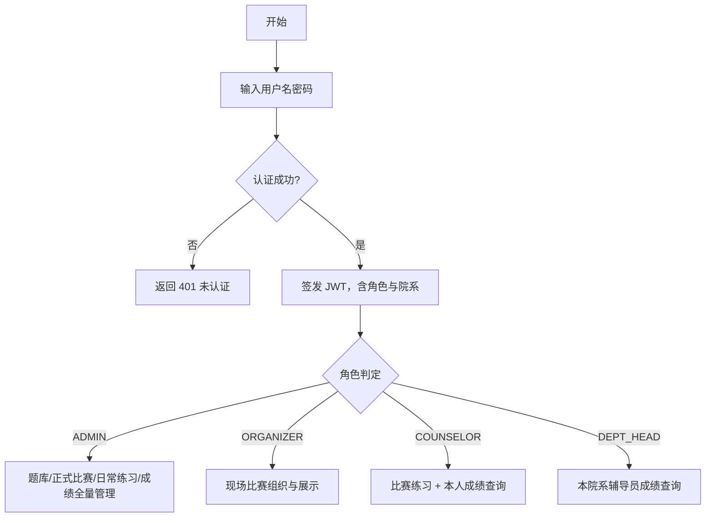
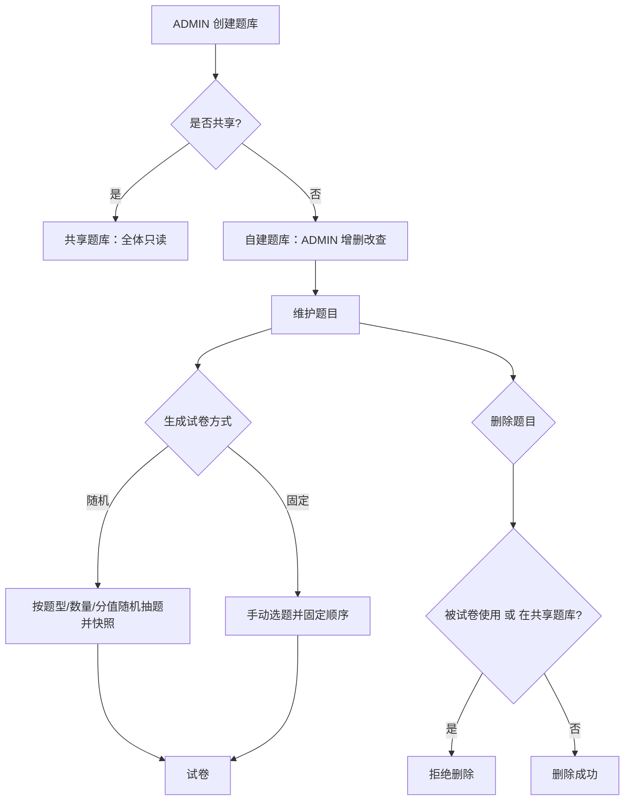
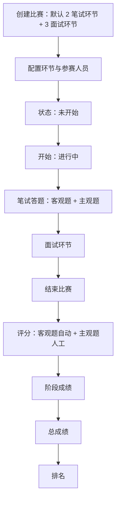
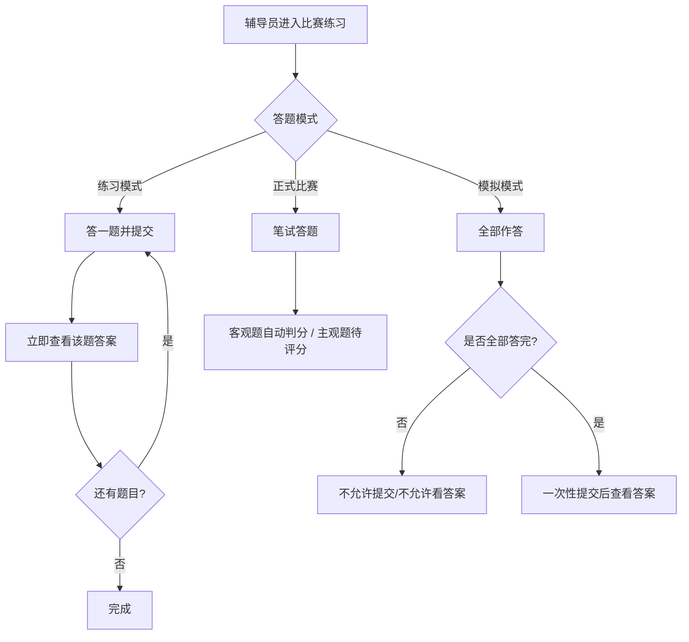
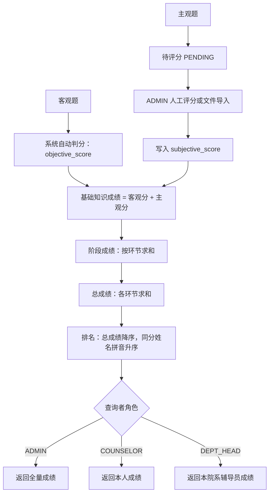
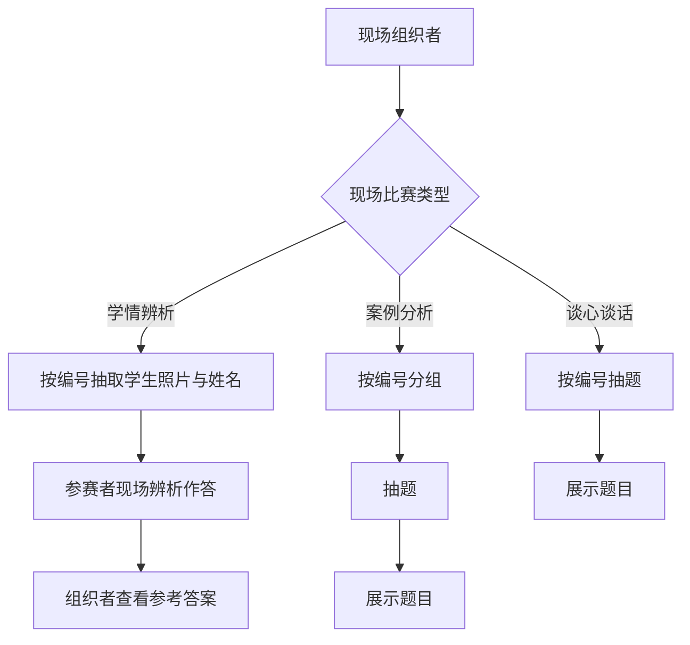

# 流程图 —— 辅导员训练平台

> 本文件填补作业文档「三、流程图」的空白，使用 Mermaid 语法描述核心业务流程。渲染环境若需将代码块视为 Mermaid，请用标准 mermaid 代码围栏（见各图下方说明）。

## 1. 用户登录与权限分流

## 2. 题库管理与试卷生成

## 3. 正式比赛流程

## 4. 比赛练习答题流程

## 5. 成绩查询与评分流程

## 6. 现场比赛流程

---

> 以上流程与 specs/spec.md 的业务规则、docs/api.md 的接口一一对应，可作为评审与实现的参照。